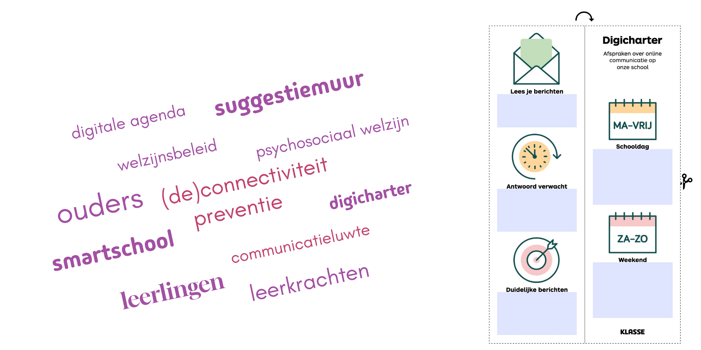
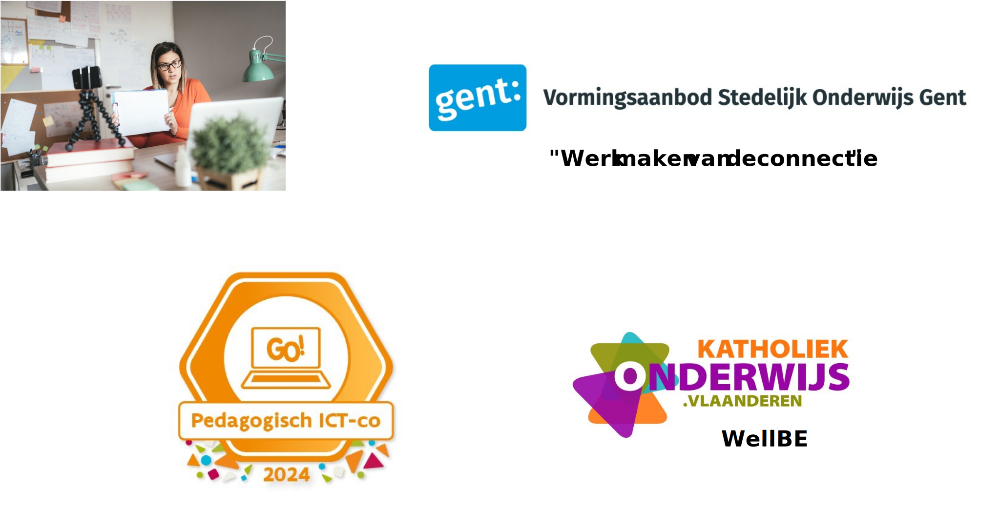

<!--
title: "Het recht op deconnectie in het Vlaamse onderwijs"
language: nl
narrator: Dutch Female
mode: Presentation

import: https://raw.githubusercontent.com/LiaScript/CodeRunner/master/README.md
        https://raw.githubusercontent.com/LiaTemplates/BeforeAndAfter/0.0.1/README.md

link:   https://cdnjs.cloudflare.com/ajax/libs/animate.css/4.1.1/animate.min.css
        https://fonts.googleapis.com/css?family=Lato:400,400italic,700
        style.css

@runR: @LIA.eval(`["main.R"]`, `none`, `Rscript main.R`)

@JSONLD

@end

link:   https://unpkg.com/leaflet@1.9.4/dist/leaflet.css
script: https://unpkg.com/leaflet@1.9.4/dist/leaflet.js

-->

# Welkom

[Laten we beginnen!](https://liascript.github.io/course/?https://raw.githubusercontent.com/abotzki/presentation/refs/heads/master/deconnectie.md)

De presentatie wordt volledig op je computer geladen. Vervolgens kan je met de pijltoetsen van je toetsenbord door de presentatie gaan. Klik uiteraard ook op het Luidspreker icoontje onderaan de pagina om de uitleg bij elke slide te kunnen beluisteren.

# Recht op deconnectie in het Vlaams onderwijs 

        --{{0}}--
?[⏯](./img/slide-00-inleiding.mp3)
Beste medestudenten, Stel u voor: het is vrijdagavond, u heeft net een lange werkweek achter de rug en u kijkt uit naar een ontspannen weekend. Maar dan, net als u zich neerzet met een goed boek of een film, pingt uw telefoon. Een e-mail van uw directeur. Moet u reageren? Of heeft u het recht om te deconnecteren? Vandaag duiken we in een cruciaal en actueel thema: “Leeft het recht op deconnectie enkel op papier of is het ingeburgerd in het Vlaams onderwijs?” 

     --{{0}}--
In een wereld waar technologie ons constant verbindt, is het belangrijker dan ooit om te begrijpen wat dit recht inhoudt en hoe het in de praktijk wordt toegepast. Laten we samen bekijken hoe het Vlaamse onderwijs dit recht benadert en welke lessen we kunnen trekken voor een gezonde balans tussen werk en privéleven. Bent u klaar om deze reis met mij te maken? Laten we beginnen!

[^🦶]: Designed by Freepik: https://www.freepik.com/free-vector/hand-drawn-endless-scrolling-illustration_64776684.htm

# Digitale competenties 

       --{{0}}--
?[⏯](./img/slide-01-digitale-competenties.mp3)
Laat ons eerst op digitale competenties inzoomen. De leerkracht werkt aan 16 sleutelcompetenties, waaronder digitale vaardigheden en mediawijsheid. Dit vereist dat je je vaardigheden onderhoudt om als innovator in het onderwijs te functioneren. De Vlaamse overheid heeft met de Digisprong geprobeerd de digitale kloof te dichten en de digitale vaardigheden van leerkrachten te versterken. Het nieuwe regeerakkoord stelt voor om deze operatie voort te zetten door te investeren in ICT-infrastructuur voor leerlingen, leraren en schoolteams. Het doel is een positieve houding ten opzichte van digitale technologieën te stimuleren en creatief en kritisch gebruik aan te moedigen. Echter, het toenemende aanbod aan digitale communicatietools en de variabiliteit van eduTools stellen hoge eisen aan de digitale vaardigheden van leerkrachten en leerlingen. De continue noodzaak om deze tools te gebruiken kan leiden tot het niet weten wanneer te deconnecteren. Daarom is het essentieel dat de schoolgemeenschap digitaal vaardig is en bewust blijft van haar digitale grenzen.

             --{{0}}--
De leerkracht werkt doelgericht aan 16 sleutelcompetenties waaronder digitale competenties en mediawijsheid bij de leerlingen. Dit houdt in dat je hierin zelf voldoende vaardig bent en je vaardigheden op peil houdt om tegemoet te komen aan je rol als innovator, een van de 10 basiscompetenties van de leraar secundair onderwijs. Ondersteunend heeft de Vlaamse overheid met de Digisprong een serieuze poging gedaan om de digitale kloof te dichten en de digitale competenties van leerkrachten te versterken. Dit initiatief toont aan dat er een duidelijke intentie is om de digitale vaardigheden in het onderwijs te verbeteren. De vier speerpunten van de Digisprong – infrastructuur, beleid, opleiding en een kenniscentrum – zijn concrete stappen die de theorie in de praktijk moeten brengen. Ook in het nieuwe regeerakkoord stelt de Vlaamse regering voor om de historische stap veilig te stellen door een vervolg te breien aan deze belangrijke operatie. Ze herhalen dus de investering in de noodzakelijke ICT-infrastructuur voor leerlingen, leraren en schoolteams. Doel is dat de Digisprong een positieve houding ten opzichte van digitale technologieën stimuleert en het creatief en kritisch gebruik aanmoedigt. Door leerkrachten te professionaliseren en hen te voorzien van de nodige middelen en ondersteuning, wordt een omgeving gecreëerd waarin digitale technologieën op een constructieve manier kunnen worden geïntegreerd in het onderwijs.
Echter, het steeds toenemende aanbod aan digitale communicatietools, zoals email, Whatsapp, Smartschool, etc., en de grote variabiliteit van eduTools stellen zeer hoge eisen aan de digitale vaardigheden van leerkrachten en leerlingen. De continue nood tot het gebruik van deze tools kan het risico vergroten dat leerkrachten en leerlingen niet meer weten wanneer ze moeten deconnecteren. Daarom is het essentieel dat de volledige schoolgemeenschap niet alleen digitaal vaardig is, maar ook bewust blijven van haar digitale grenzen.

[^🦶]: https://img.freepik.com/free-vector/brainstorm-line-style-colored-illustration-with-young-creative-man-woman_1284-54399.jpg?ga=GA1.1.747062422.1727286614; https://www.smartschool.be/wp/wp-content/uploads/2018/09/smartschool-logo_340x120.png; Vlaams regeerakkoord 2024-2029

# Welzijnszorg 
   
      --{{0}}--
?[⏯](./img/slide-02-welzijnszorg.mp3)
Welzijnszorg is bevoegheid van de Vlaamse gemeenschap. Een goede werk-privébalans voor leraren en het welbevinden van scholieren zijn van cruciaal belang. Een studie over de werkbaarheid van jobs in scholen, uitgevoerd door de Stichting Arbeid en Innovatie, toont als pijnpunten werkstressklachten, emotionele belasting, motivatieproblemen en een verstoorde werk-privébalans. De Vlaamse overheid kan helpen met centrale regelgeving, zoals het afsprakenkader deconnectie uit 2022. Ook schoolbesturen en directeurs hebben een belangrijke rol in het verminderen van werkstress door hun maatregelen te evalueren op hun impact op het personeel. Jongeren hebben volgens de Apenstaartjarenstudie 2024 moeite om buiten schooluren te ontsnappen aan mails van leerkrachten, zitten vast in verslavende TikTok-algoritmes en meldingen van sociale media. Schermen hebben een grote negatieve impact, maar bieden ook ontspanning en betere connecties met vrienden. Het probleem van constante verbondenheid treft dus jongeren en volwassenen tegelijkertijd en moet als maatschappij aangepakt worden.

      --{{0}}--
Welzijnszorg is bevoegheid van de Vlaamse gemeenschap. Een goede werk-privébalans voor leraren en het welbevinden van scholieren zijn van cruciaal belang. Door digitale deconnectie te bevorderen, kunnen we stress en burn-out verminderen, wat leidt tot een gezondere en productievere onderwijsomgeving.
Naast deconnectie legt een studie over de werkbaarheid van jobs in de scholen die in opdracht van de Vlaamse sociale partnere door de Stichting Arbeid en Innovatie uitgevoerd werd werkstressklachten, emotionele belasting, motivatieproblemen, en een verstoorde balans werk-privé als pijnpunten bloot. Al deze pijnpunten verdienen aandacht, maar de werkstressklachten springen eruit. De Vlaamse overheid kan hier zeker haar rol spelen door centrale regelgeving op te stellen. We denken hier bijvoorbeeld aan het afsprakenkader deconnectie, dat in 2022 tot stand is gekomen en een globaal kader biedt over het gebruik van digitale communicatie in de school of het centrum. Maar ook de lagere echelons – de koepels over de school- en centrumbesturen tot de directeurs – dragen een belangrijke verantwoordelijkheid. Zij moeten zich bij iedere maatregel die zij aan het personeel opleggen de vraag stellen of en in welke zin die de werkstress beïnvloedt. Zij hebben zowel formeel als feitelijk veel impact op de werksituatie van het personeel.

[^🦶]: Vlaams Minister van Welzijn Caroline Gennez https://upload.wikimedia.org/wikipedia/commons/thumb/1/1b/Gennez_Lenar%C4%8Di%C4%8D_2024_%28cropped%29.jpg/440px-Gennez_Lenar%C4%8Di%C4%8D_2024_%28cropped%29.jpg; https://www.freepik.com/free-vector/happy-man-sitting-scales-with-words-work-life_19216563.htm; ./img/notifications-smartschool.svg; adapted from freepik https://www.freepik.com/free-photo/student-holding-smartphone-against-open-copybook_1281557.htm

# Beleidscyclus

   --{{0}}--
?[⏯](./img/slide-03-beleidscyclus.mp3)
Via de beleidscyclus is het recht op deconnectie ook op schoolniveau in voege gekomen. De beleidscyclus op Vlaams niveau wordt vaak beinvloed door de ontwikkeling van Europese richtlijnen en Belgische wetten. Hier een korte duik in de recente geschiedenis: de sociale partners in Vlaanderen sloten in september 2021 de CAO (Collectieve ArbeidsOvereenkomst) XII af waar onder anderen ook aanbevelingen over gebruik van digitale communicatiemiddelen naar voren geschoven werden. Een jaar later werd dit globale kader werd in de schoot van de onderhandelingscomités (SCX-C2-OOC en VOCB) vertaald naar een centraal afsprakenkader. Dit centrale kader vereiste dat scholen uiterlijk op 1 september 2023 een lokaal afsprakenkader deconnectie opnemen als bijlage bij het arbeids- en schoolreglement. In het huidige Vlaamse regeerakkoord valt het expliciete vernoemen van een smartphonebeleid wat het geschetste beleidscyclus opnieuw zal voeden. Samen met het boven vermeld onderzoek naar mentaal welzijn ondersteunen deze maatregelen de beleidsvorming, waardoor er een solide basis ontstaat voor het implementeren van digitale deconnectie in scholen. 

[^🦶]: https://onderwijs.vlaanderen.be/nl/nieuws/cao-xii-principieel-goedgekeurd; https://onderwijs.vlaanderen.be/sites/default/files/2022-09/2022_09_09_herwerkt_voorstel_aanbevelingen_bevoegde_comit%C3%A9s_over_gebruik_dig_communicatiemiddelen_na_OC_22070.pdf; https://www.ovsg.be/onze-themas/personeelsbeleid-loopbaan/loopbaan-gesubsidieerd-personeel/arbeidsreglement/afsprakenkader-deconnectie; https://www.freepik.com/free-vector/politician-sitting-round-table-boardroom-board-directors-with-ceo-holding-formal-talk-office-room-flat-vector-illustration-business-authority-corporate-leader-planning-strategy-concept_22343998.htm#fromView=search&page=1&position=0&uuid=19dbd7a7-af9c-453f-84c0-c418ba1b65b9; bijgewerkt startende van https://www.freepik.com/free-vector/terms-conditions-abstract-concept-illustration_20769872.htm 

# Digitaliseringsbeleid

   --{{0}}--
?[⏯](./img/slide-04-digitaliseringsbeleid.mp3)
Digitaliseringsbeleid op lokaal niveau, zoals afsprakenkaders en arbeidsreglementen, helpt bij het creëren van duidelijke richtlijnen voor het gebruik van digitale tools. De speerpunten van dit kader zijn gericht op het inzetten van digitale communicatiemiddelen om onderwijspersoneel, leerlingen, cursisten en ouders te ontlasten, niet te belasten. In vele scholen werd ook reeds nagedacht hoe ze dit ook voor leerlingen kunnen garanderen. In het Lyceum van Genk werd bijvoorbeeld via een suggestiemuur input gevraagd van leerlingen, leerkrachten en ouders. Dit resulteerde in een visueel Smartschool-Charter. Het lokale afsprakenkader krijgt zo een duidelijke plaats binnen het preventieve welzijnsbeleid van onderwijsinstellingen en besteedt aandacht aan de impact van (de)connectiviteit op het psychosociaal welzijn. Maar ook hier zal de tijd niet stilstaan gezien we in het nieuwe Vlaamse regeerakkoord kunnen lezen 'We (= de regering) zorgen dat scholen een beleid opstellen rond digitalisering in hun school. We versterken de samenwerking met de EdTech-sector."

> “We zorgen dat scholen een beleid opstellen rond digitalisering in hun school. 
> We versterken de samenwerking met de EdTech-sector." 
>
> -- Vlaams regeerakkoord 2024-2029

[^🦶]: https://www.scholierenkoepel.be/kennisbank/welbevinden-in-juli; digi-charter Klasse https://www.klasse.be/wp/wp-content/uploads/2022/09/KenP_digicharter_bladwijzer.pdf

# Professionalisering & Levenslang leren

    --{{0}}--
?[⏯](./img/slide-05-professionalisering.mp3)
Tenslotte: de professionalisering & Levenslang leren. Sensibilisering speelt een cruciale rol in digitalisering en welzijnsbeleid. Vandaar dat verscheidene spelers in het Vlaams onderwijsveld een waaier aan opleidingen en beleidstools aanbieden rond bewustwording rond digitale deconnectie en nieuwe ontwikkelingen op het gebied van digitale vaardigheden. Pedagogische ICT-coördinatoren en tools van organisaties zoals Idewe en Klasse helpen personeelsleden om beter om te gaan met de digitale eisen van hun werk. Tijdens studiedagen en seminaries, zoals die van Stedelijk Onderwijs Gent, wordt er gewerkt aan deconnectie. Deze evenementen sensibiliseren en ondersteunen personeelsleden om werk te maken van een geïntegreerd welzijnsbeleid. Een voorbeeld hiervan is het online instrument WellBe, dat speciaal is ontwikkeld om dit proces te faciliteren. Al deze opleidingen en tools dragen bij aan een professionele en gezonde werkomgeving waarin de balans tussen connectie en deconnectie wordt gerespecteerd.

[^🦶]: https://www.idewe.be/-/deconnectie-onderwijs; https://stad.gent/vormingsaanbodsog/individueel-aanbod/seminarie-met-gunnar-michielsen-werk-maken-van-deconnectie; https://pro.g-o.be/agenda/7734-15218-opleiding-go-pedagogisch-ict-co; https://nascholing.be/2024-2025/index.aspx?modID=4057250; DigiCompEdu

# De drie stellingen - graag jullie reacties!

- Strenger handhaven van deconnectie in het onderwijs is nodig voor een betere werk-privébalans, ondanks het nieuwe smartphonebeleid.

- Meer investeringen in bewustwording en trainingen omtrent deconnectie zijn nodig om de negatieve impact van constante digitale verbondenheid te verminderen.

- De nadruk op digitale competenties en eduTools vanuit de overheid vereist dat scholen preventieve maatregelen nemen om het recht op deconnectie te waarborgen.

# References

- Afsprakenkader deconnectie. (2023, mei 16). OVSG. https://www.ovsg.be/onze-themas/personeelsbeleid-loopbaan/loopbaan-gesubsidieerd-personeel/arbeidsreglement/afsprakenkader-deconnectie
- Doordacht aan de slag met ICT op school (ja, ook met smartphones). (2024, augustus 24). https://pro.g-o.be/nieuws/doordacht-aan-de-slag-met-ict-op-school-ja-ook-met-smartphones/
- Jellasics, T. (2023a, maart 20). Deconnecteren: Hoe je de knop afzet, zonder de stekker uit te trekken. Klasse. https://www.klasse.be/628413/als-leraar-deconnecteren-rosanne-volckaert/
- Jellasics, T. (2023b, maart 20). Deconnectie: 3 leraren over spanning. Klasse. https://www.klasse.be/628663/hoe-3-leraren-deconnecteren/
- Oudere jongeren en meisjes gevoeliger voor klachten rond digitaal welzijn. (2024, oktober 2). https://www.mediapuntvlaanderen.be/updates-analyse/dataduik-digitaal-welzijn-bij-jongeren
- Scholierenkoepel | Welbevinden in juli: Aandacht voor deconnectie. (2024, juli 1). https://www.scholierenkoepel.be/kennisbank/welbevinden-in-juli
- Vlaams regeerakkoord. (2024, september 30). Vlaamse Regering. https://publicaties.vlaanderen.be/view-file/69476
- Werkbaar werk in het onderwijs: Wat zijn de risicofactoren? - Acodonline. (2024, oktober 1). https://www.acodonline.be/artikelsdetails/werkbaar-werk-in-het-onderwijs-wat-zijn-de-risicofactoren-/2448477d-6314-492c-866a-f1263b1b7bab

