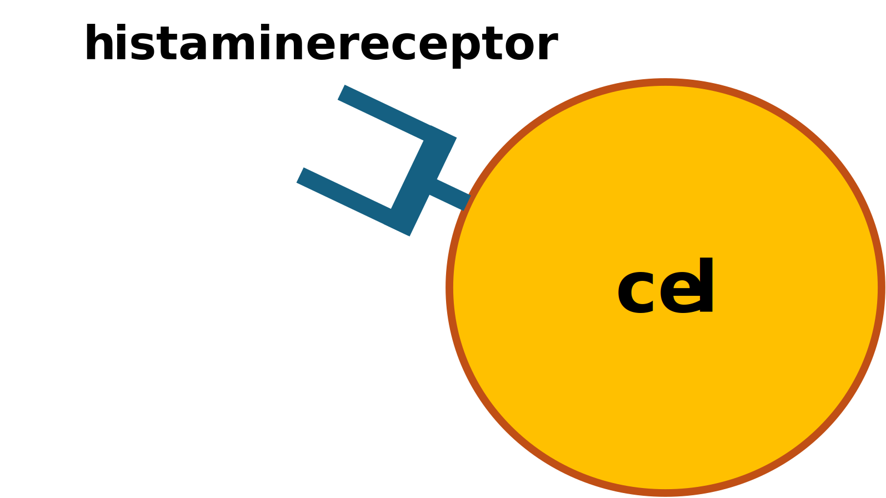
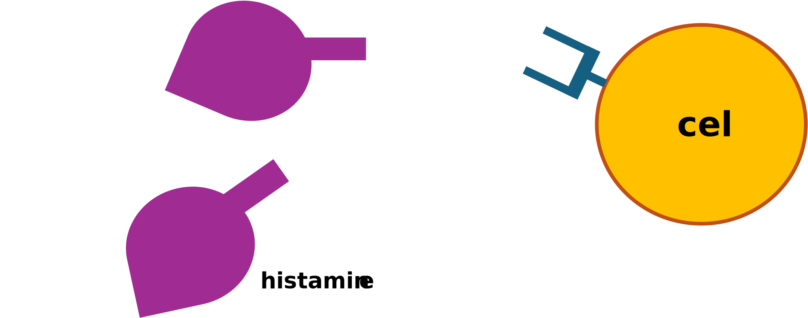
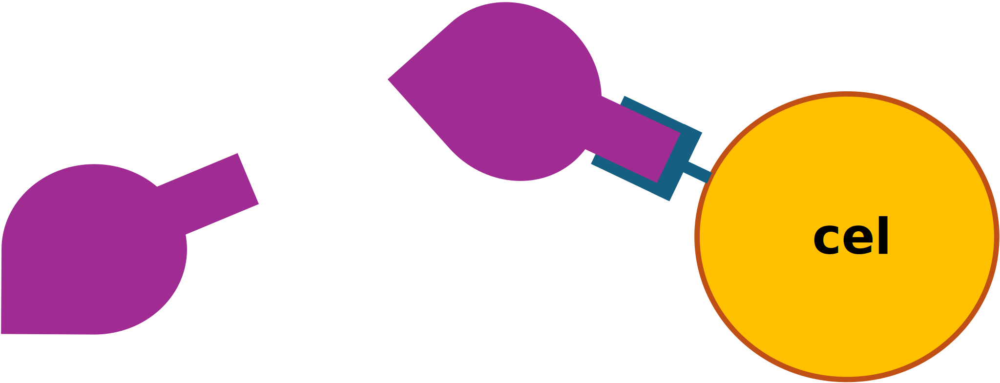

<!--
title: "Sleutel-Slot-principe"
language: nl
narrator: Dutch Female
mode: Presentation

import: https://raw.githubusercontent.com/LiaScript/CodeRunner/master/README.md
        https://raw.githubusercontent.com/LiaTemplates/BeforeAndAfter/0.0.1/README.md

link:   https://cdnjs.cloudflare.com/ajax/libs/animate.css/4.1.1/animate.min.css
        https://fonts.googleapis.com/css?family=Lato:400,400italic,700
        style.css

@runR: @LIA.eval(`["main.R"]`, `none`, `Rscript main.R`)

@JSONLD

@end

link:   https://unpkg.com/leaflet@1.9.4/dist/leaflet.css
script: https://unpkg.com/leaflet@1.9.4/dist/leaflet.js

-->

# Welkom

> We gebruiken de interactieve Open Educational Resource online/offline infrastructuur LiaScript.
> [Laten we beginnen!](https://liascript.github.io/course/?https://raw.githubusercontent.com/abotzki/presentation/refs/heads/master/sleutel-slot-principe.md)

De presentatie wordt volledig op je computer geladen. Vervolgens kan je met de pijltoetsen van je toetsenbord door de presentatie gaan. Klik uiteraard ook op het Luidspreker icoontje onderaan de pagina om de uitleg bij elke slide te kunnen beluisteren.

# Welke doelen heeft deze korte presentatie? 

        --{{0}}--
?[⏯](./img/slide-00-inleiding.mp3)
Beste medestudenten, Stel u voor: het is vrijdagavond, u heeft net een lange werkweek achter de rug en u kijkt uit naar een ontspannen weekend. Maar dan, net als u zich neerzet met een goed boek of een film, pingt uw telefoon. Een e-mail van uw directeur. Moet u reageren? Of heeft u het recht om te deconnecteren? Vandaag duiken we in een cruciaal en actueel thema: “Leeft het recht op deconnectie enkel op papier of is het ingeburgerd in het Vlaams onderwijs?” 

     --{{0}}--
In een wereld waar technologie ons constant verbindt, is het belangrijker dan ooit om te begrijpen wat dit recht inhoudt en hoe het in de praktijk wordt toegepast. Laten we samen bekijken hoe het Vlaamse onderwijs dit recht benadert en welke lessen we kunnen trekken voor een gezonde balans tussen werk en privéleven. Bent u klaar om deze reis met mij te maken? Laten we beginnen!

* je kunt het sleutel-slot principe in een biologische contekst herkennen

* je kunt beschrijven wat het sleutel-slot-principe in de biochemie betekent

[^🦶]: Designed by Freepik: https://www.freepik.com/free-vector/hand-drawn-endless-scrolling-illustration_64776684.htm

# Welke doelen heeft deze korte presentatie? 

        --{{0}}--
?[⏯](./img/slide-00-inleiding.mp3)
Beste medestudenten, Stel u voor: het is vrijdagavond, u heeft net een lange werkweek achter de rug en u kijkt uit naar een ontspannen weekend. Maar dan, net als u zich neerzet met een goed boek of een film, pingt uw telefoon. Een e-mail van uw directeur. Moet u reageren? Of heeft u het recht om te deconnecteren? Vandaag duiken we in een cruciaal en actueel thema: “Leeft het recht op deconnectie enkel op papier of is het ingeburgerd in het Vlaams onderwijs?” 

     --{{0}}--
In een wereld waar technologie ons constant verbindt, is het belangrijker dan ooit om te begrijpen wat dit recht inhoudt en hoe het in de praktijk wordt toegepast. Laten we samen bekijken hoe het Vlaamse onderwijs dit recht benadert en welke lessen we kunnen trekken voor een gezonde balans tussen werk en privéleven. Bent u klaar om deze reis met mij te maken? Laten we beginnen!

[^🦶]: Designed by Freepik: https://nl.freepik.com/vrije-photo/beveiligingsconcept-met-slot_22632767.htm#fromView=search&page=1&position=49&uuid=abfcf2c4-41ae-4315-beea-83b36deca858; https://nl.freepik.com/vrije-photo/hou-van-hangsloten-op-metalen-reling_9898302.htm#fromView=search&page=1&position=47&uuid=03fe7b58-ae23-4945-81f7-4d3d14f83ffc

# Binnenkort weer hooikoorts? 

   --{{0}}--
?[⏯](./img/slide-03-beleidscyclus.mp3)
Via de beleidscyclus is het recht op deconnectie ook op schoolniveau in voege gekomen. De beleidscyclus op Vlaams niveau wordt vaak beinvloed door de ontwikkeling van Europese richtlijnen en Belgische wetten. Hier een korte duik in de recente geschiedenis: de sociale partners in Vlaanderen sloten in september 2021 de CAO (Collectieve ArbeidsOvereenkomst) XII af waar onder anderen ook aanbevelingen over gebruik van digitale communicatiemiddelen naar voren geschoven werden. Een jaar later werd dit globale kader werd in de schoot van de onderhandelingscomités (SCX-C2-OOC en VOCB) vertaald naar een centraal afsprakenkader. Dit centrale kader vereiste dat scholen uiterlijk op 1 september 2023 een lokaal afsprakenkader deconnectie opnemen als bijlage bij het arbeids- en schoolreglement. In het huidige Vlaamse regeerakkoord valt het expliciete vernoemen van een smartphonebeleid wat het geschetste beleidscyclus opnieuw zal voeden. Samen met het boven vermeld onderzoek naar mentaal welzijn ondersteunen deze maatregelen de beleidsvorming, waardoor er een solide basis ontstaat voor het implementeren van digitale deconnectie in scholen. 

<!-- style="font-size: 2em" -->
> Geen vuiltje aan de lucht

[^🦶]: https://www.c3.nl/wp-content/uploads/woocommerce_uploads/2018/02/Voor-de-leerling-Knutselen-met-moleculen.pdf

# Binnenkort weer hooikoorts? 

   --{{0}}--
?[⏯](./img/slide-03-beleidscyclus.mp3)
Via de beleidscyclus is het recht op deconnectie ook op schoolniveau in voege gekomen. De beleidscyclus op Vlaams niveau wordt vaak beinvloed door de ontwikkeling van Europese richtlijnen en Belgische wetten. Hier een korte duik in de recente geschiedenis: de sociale partners in Vlaanderen sloten in september 2021 de CAO (Collectieve ArbeidsOvereenkomst) XII af waar onder anderen ook aanbevelingen over gebruik van digitale communicatiemiddelen naar voren geschoven werden. Een jaar later werd dit globale kader werd in de schoot van de onderhandelingscomités (SCX-C2-OOC en VOCB) vertaald naar een centraal afsprakenkader. Dit centrale kader vereiste dat scholen uiterlijk op 1 september 2023 een lokaal afsprakenkader deconnectie opnemen als bijlage bij het arbeids- en schoolreglement. In het huidige Vlaamse regeerakkoord valt het expliciete vernoemen van een smartphonebeleid wat het geschetste beleidscyclus opnieuw zal voeden. Samen met het boven vermeld onderzoek naar mentaal welzijn ondersteunen deze maatregelen de beleidsvorming, waardoor er een solide basis ontstaat voor het implementeren van digitale deconnectie in scholen. 

<!-- style="font-size: 2em" -->
> Je ruikt gevaar, histamine is vrijgekomen

[^🦶]: https://www.c3.nl/wp-content/uploads/woocommerce_uploads/2018/02/Voor-de-leerling-Knutselen-met-moleculen.pdf

# Binnenkort weer hooikoorts? 

   --{{0}}--
?[⏯](./img/slide-03-beleidscyclus.mp3)
Via de beleidscyclus is het recht op deconnectie ook op schoolniveau in voege gekomen. De beleidscyclus op Vlaams niveau wordt vaak beinvloed door de ontwikkeling van Europese richtlijnen en Belgische wetten. Hier een korte duik in de recente geschiedenis: de sociale partners in Vlaanderen sloten in september 2021 de CAO (Collectieve ArbeidsOvereenkomst) XII af waar onder anderen ook aanbevelingen over gebruik van digitale communicatiemiddelen naar voren geschoven werden. Een jaar later werd dit globale kader werd in de schoot van de onderhandelingscomités (SCX-C2-OOC en VOCB) vertaald naar een centraal afsprakenkader. Dit centrale kader vereiste dat scholen uiterlijk op 1 september 2023 een lokaal afsprakenkader deconnectie opnemen als bijlage bij het arbeids- en schoolreglement. In het huidige Vlaamse regeerakkoord valt het expliciete vernoemen van een smartphonebeleid wat het geschetste beleidscyclus opnieuw zal voeden. Samen met het boven vermeld onderzoek naar mentaal welzijn ondersteunen deze maatregelen de beleidsvorming, waardoor er een solide basis ontstaat voor het implementeren van digitale deconnectie in scholen. 

<!-- style="font-size: 2em" -->
> Groot alarm -- je ogen tranen, je hebt een snotneus en kriebel in je keel...

[^🦶]: https://www.c3.nl/wp-content/uploads/woocommerce_uploads/2018/02/Voor-de-leerling-Knutselen-met-moleculen.pdf

# Samenvatting
   
      --{{0}}--
?[⏯](./img/slide-02-welzijnszorg.mp3)
Welzijnszorg is bevoegheid van de Vlaamse gemeenschap. Een goede werk-privébalans voor leraren en het welbevinden van scholieren zijn van cruciaal belang. Een studie over de werkbaarheid van jobs in scholen, uitgevoerd door de Stichting Arbeid en Innovatie, toont als pijnpunten werkstressklachten, emotionele belasting, motivatieproblemen en een verstoorde werk-privébalans. De Vlaamse overheid kan helpen met centrale regelgeving, zoals het afsprakenkader deconnectie uit 2022. Ook schoolbesturen en directeurs hebben een belangrijke rol in het verminderen van werkstress door hun maatregelen te evalueren op hun impact op het personeel. Jongeren hebben volgens de Apenstaartjarenstudie 2024 moeite om buiten schooluren te ontsnappen aan mails van leerkrachten, zitten vast in verslavende TikTok-algoritmes en meldingen van sociale media. Schermen hebben een grote negatieve impact, maar bieden ook ontspanning en betere connecties met vrienden. Het probleem van constante verbondenheid treft dus jongeren en volwassenen tegelijkertijd en moet als maatschappij aangepakt worden.

      --{{0}}--
Welzijnszorg is bevoegheid van de Vlaamse gemeenschap. Een goede werk-privébalans voor leraren en het welbevinden van scholieren zijn van cruciaal belang. Door digitale deconnectie te bevorderen, kunnen we stress en burn-out verminderen, wat leidt tot een gezondere en productievere onderwijsomgeving.
Naast deconnectie legt een studie over de werkbaarheid van jobs in de scholen die in opdracht van de Vlaamse sociale partnere door de Stichting Arbeid en Innovatie uitgevoerd werd werkstressklachten, emotionele belasting, motivatieproblemen, en een verstoorde balans werk-privé als pijnpunten bloot. Al deze pijnpunten verdienen aandacht, maar de werkstressklachten springen eruit. De Vlaamse overheid kan hier zeker haar rol spelen door centrale regelgeving op te stellen. We denken hier bijvoorbeeld aan het afsprakenkader deconnectie, dat in 2022 tot stand is gekomen en een globaal kader biedt over het gebruik van digitale communicatie in de school of het centrum. Maar ook de lagere echelons – de koepels over de school- en centrumbesturen tot de directeurs – dragen een belangrijke verantwoordelijkheid. Zij moeten zich bij iedere maatregel die zij aan het personeel opleggen de vraag stellen of en in welke zin die de werkstress beïnvloedt. Zij hebben zowel formeel als feitelijk veel impact op de werksituatie van het personeel.

- Het sleutel-slot principe is essentieel voor het begrijpen van moleculaire interacties in de biologie en heeft brede toepassingen in de wetenschap en geneeskunde.
- Het sleutel-slot principe wordt toegepast in enzym-substraat interacties, hormoon-receptor binding, en medicijnontwerp.

[^🦶]: Emil Fischer https://en.wikipedia.org/wiki/File:Hermann_Emil_Fischer_c1895.jpg; 

# Referenties

- Knutselen met moleculen. (2018, februari). Centrum Jongeren­Communicatie Chemie. https://www.c3.nl/wp-content/uploads/woocommerce_uploads/2018/02/Voor-de-leerling-Knutselen-met-moleculen.pdf
- Emil Fischer. (2024 december 1) https://en.wikipedia.org/wiki/Emil_Fischer

