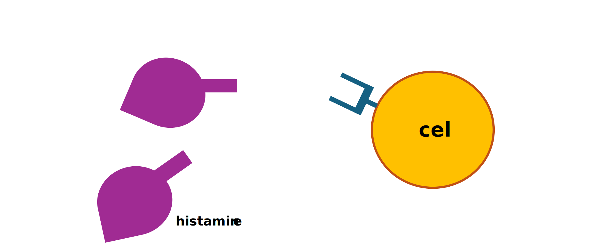
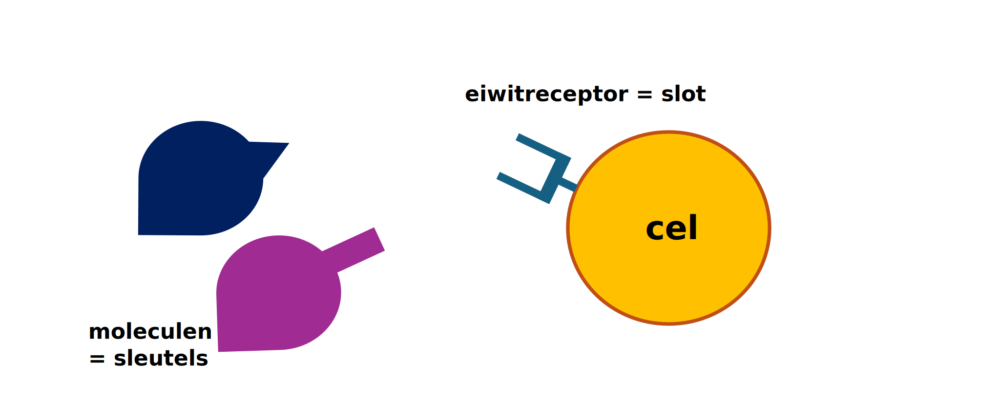

<!--
title: "Sleutel-Slot-principe"
language: nl
narrator: Dutch Female
mode: Presentation

import: https://raw.githubusercontent.com/LiaScript/CodeRunner/master/README.md
        https://raw.githubusercontent.com/LiaTemplates/BeforeAndAfter/0.0.1/README.md

link:   https://cdnjs.cloudflare.com/ajax/libs/animate.css/4.1.1/animate.min.css
        https://fonts.googleapis.com/css?family=Lato:400,400italic,700
        style.css

@runR: @LIA.eval(`["main.R"]`, `none`, `Rscript main.R`)

@JSONLD

@end

link:   https://unpkg.com/leaflet@1.9.4/dist/leaflet.css
script: https://unpkg.com/leaflet@1.9.4/dist/leaflet.js

-->

# Welkom

> We gebruiken de interactieve Open Educational Resource online/offline infrastructuur LiaScript.
> [Laten we beginnen!](https://liascript.github.io/course/?https://raw.githubusercontent.com/abotzki/presentation/refs/heads/master/sleutel-slot-principe.md)

De presentatie wordt volledig op je computer geladen. Vervolgens kan je met de pijltoetsen van je toetsenbord door de presentatie gaan. Klik uiteraard ook op het Luidspreker icoontje onderaan de pagina om de uitleg bij elke slide te kunnen beluisteren.

# Welke doelen heeft deze korte presentatie?

* je kunt het sleutel-slot principe in een biologische context herkennen

* je kunt beschrijven wat het sleutel-slot-principe in de biochemie betekent

# Sleutels en sloten 

   --{{0}}--
Je vindt ze vaak op bruggen in populaire touristische bestemmingen: de liefdesslotjes. Stel we zouden enkele sloten willen open krijgen. Wat hebben we nodig en hoe gaan we te werk?

<!-- style="font-size: 2em" -->
> Hoe krijgen we de liefdesslotjes open?

[^🦶]: https://nl.freepik.com/vrije-photo/beveiligingsconcept-met-slot_22632767.htm#fromView=search&page=1&position=49&uuid=abfcf2c4-41ae-4315-beea-83b36deca858; https://nl.freepik.com/vrije-photo/hou-van-hangsloten-op-metalen-reling_9898302.htm#fromView=search&page=1&position=47&uuid=03fe7b58-ae23-4945-81f7-4d3d14f83ffc

# Binnenkort weer hooikoorts? 

   --{{0}}--
Genieten van de lente is lastig als je hooikoorts hebt: snotteren, niezen en tranende ogen. Je bent of kent vast wel iemand met een allergie. Gelukkig is er iets aan te doen. Neem een antihistaminepilletje, dat is een medicijn tegen allergieverschijnselen, en je hebt veel minder last. Er bestaan al veel verschillende antihistaminemedicijnen. We weten dat alle antihistamines werken op een speciaal molecuul in je lichaam: de histaminereceptor. Een receptor is een groot molecuul (een eiwit) dat als antenne voor je cellen fungeert. Het steekt door de buitenkant van de cel heen en vangt signalen op uit de rest van je lichaam, of soms zelfs van buiten, en geeft dit binnen in de cel door.

<!-- style="font-size: 2em" -->
> Geen vuiltje aan de lucht

[^🦶]: https://www.c3.nl/wp-content/uploads/woocommerce_uploads/2018/02/Voor-de-leerling-Knutselen-met-moleculen.pdf

# Binnenkort weer hooikoorts? 

   --{{0}}--
Als er iets gevaarlijks in de lucht hangt, gaan er allerlei alarmbellen af in je lichaam. Eén zo’n noodsignaal is een klein molecuul, histamine, dat in het slijmvliesweefsel van je ogen en neus vrijkomt.

<!-- style="font-size: 2em" -->
> Je lichaam ruikt gevaar, histamine is vrijgekomen

[^🦶]: https://www.c3.nl/wp-content/uploads/woocommerce_uploads/2018/02/Voor-de-leerling-Knutselen-met-moleculen.pdf

# Binnenkort weer hooikoorts? 

   --{{0}}--
Histamine wordt vastgegrepen door de histaminereceptor. Zodra die twee elkaar hebben gevonden, weten je slijmvliescellen: ‘Er is groot alarm! We moeten extra slijm maken.’ Je ogen gaan tranen, je krijgt een snotneus en kriebel in je keel: zo probeert het lichaam de gevaarlijke deeltjes zo snel mogelijk weer kwijt te raken.

<!-- style="font-size: 2em" -->
> Groot alarm -- je ogen tranen, je hebt een snotneus en kriebel in je keel...

[^🦶]: https://www.c3.nl/wp-content/uploads/woocommerce_uploads/2018/02/Voor-de-leerling-Knutselen-met-moleculen.pdf

# Sleutels en sloten in de biologische context 

   --{{0}}--
Laat ons even terugkijken naar het verhaal van de liefdesslotjes en de sleutels. Welke moleculen kunnen we als sleutels beschrijven en welke als sloten?

<!-- style="font-size: 2em" -->
> Ook in ons lichaam hebben we 'sleutels' en 'sloten'.

[^🦶]: https://www.c3.nl/wp-content/uploads/woocommerce_uploads/2018/02/Voor-de-leerling-Knutselen-met-moleculen.pdf

# Sleutels en sloten in de biologische context 

   --{{0}}--
Precies, de kleine moleculen zoals histamine in ons voorbeeld zijn de sleutels. Deze moleculen worden ook substraten genoemd. En de eiwitten zijn de sloten -- in ons voorbeeld een histaminereceptor. Op een cel vinden we meer dan een type eitwitreceptor terug. 

<!-- style="font-size: 2em" -->
> Sleutels zijn moleculen of substraten en de sloten zijn eiwitten. 

[^🦶]: https://www.c3.nl/wp-content/uploads/woocommerce_uploads/2018/02/Voor-de-leerling-Knutselen-met-moleculen.pdf

# Sleutels en sloten in de biologische context 

   --{{0}}--
Zoals in ons voorbeeld van de liefdesslotjes bestaan er ook in ons lichaam meer dan een sleutels. En sommige sleutels passen wel, het histamine in ons voorbeeld, en andere niet, zoals de blauwe, spitse sleutel, op de histaminereceptor. 

<!-- style="font-size: 2em" -->
> Niet elke sleutel past op elk slot.

[^🦶]: https://www.c3.nl/wp-content/uploads/woocommerce_uploads/2018/02/Voor-de-leerling-Knutselen-met-moleculen.pdf

# Sleutels en sloten in de biologische context 

   --{{0}}--
Maar als je allergisch bent, gaat het alarm te vroeg af. Dan denkt je lichaam dat ongevaarlijke dingen, zoals stuifmeel, wél gevaarlijk zijn. Heel irritant! Sommige mensen lopen de hele lente te snotteren. Om hen te helpen, zijn er onder andere antihistaminemedicijnen uitgevonden. Die medicijnen plakken nog beter dan histamine zelf aan de antenne (de histaminereceptor) waardoor er geen plek meer is voor het alarmmolecuul histamine. Het alarm kan dan niet meer afgaan. De slijmcellen merken niks en je neus blijft droog.

<!-- style="font-size: 2em" -->
> Biologische sloten hebben vaak meer dan een sleutel.

[^🦶]: https://www.c3.nl/wp-content/uploads/woocommerce_uploads/2018/02/Voor-de-leerling-Knutselen-met-moleculen.pdf

# Het sleutel-slot principe is al 130 jaar oud
   
      --{{0}}--
Laat ons even samenvatten: Het sleutel-slot principe is essentieel voor het begrijpen van moleculaire interacties in de biologie en heeft brede toepassingen in de wetenschap en geneeskunde. Sleutels zijn moleculen of substraten en de sloten zijn eiwitten. Niet elke sleutel past op elk slot en biologische sloten hebben vaak meer dan een sleutel. Dit prinzipe wert 1894 door Emil Fischer hypothetisch beschreven aan de hand van de spezifieke interactie tussen een enzym, een eiwit, en substraat. Het sleutel-slot principe wordt toegepast bij hormoon-receptor binding, enzym-substraat interacties, en bij medicijnontwerp.

Het sleutel-slot principe wordt toegepast in enzym-substraat interacties, hormoon-receptor binding, en medicijnontwerp.

[^🦶]: Emil Fischer https://en.wikipedia.org/wiki/File:Hermann_Emil_Fischer_c1895.jpg; 

# Referenties

- Knutselen met moleculen. (2018, februari). Centrum Jongeren­Communicatie Chemie. https://www.c3.nl/wp-content/uploads/woocommerce_uploads/2018/02/Voor-de-leerling-Knutselen-met-moleculen.pdf
- Emil Fischer. (2024 december 1) https://en.wikipedia.org/wiki/Emil_Fischer

